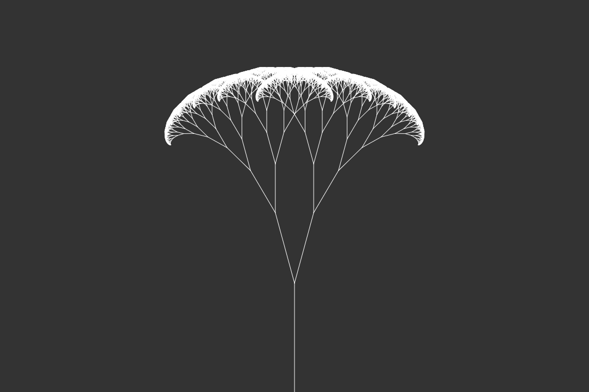

# Fractal Tree
This project is the implementation of the [Fractal Tree] (https://en.wikipedia.org/wiki/Fractal_tree_index), this fractal consists of recursively applying a rotation in the generation of the branch and decreasing its length in half. This process performed repeatedly generate a tree.

## Preview 

## Running
To execute this project, just open the `index.html` in your browser.
