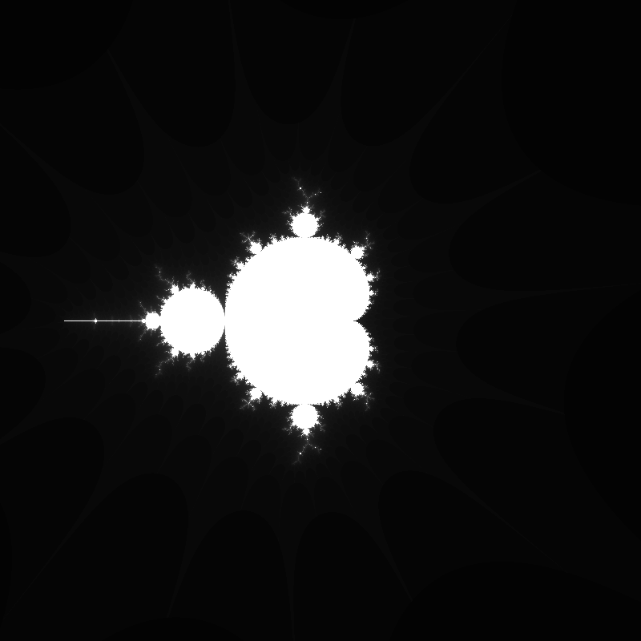

# Mandelbrot Set
This project is the implementation of the [Mandelbrot Set](https://en.wikipedia.org/wiki/Mandelbrot_set), performed in the P5.js library. The Mandelbrot Set is the set of complex numbers c for which the function fc(z) = z² + c does not diverge when iterated from z > 0.

Bellow you can check the example:

## Running
To execute this project, just open the `index.html` in your browser.