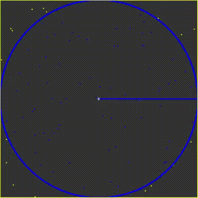

# Monte Carlo Pi
This project is the implementation of the [Monte Carlo Pi](https://en.wikipedia.org/wiki/Monte_Carlo_method), performed in the P5.js library. This method consists in the idea of throwing random points in the canvas. Some points will be inside the circle, others will be outside the circle (inside the square). The more points you have, closer you are to cover the whole area of the shapes. By apllyin a relation beetween the areas of the shapes, it is possible to estimate the number PI.

Bellow you can check the example:

## Running
To execute this project, just open the `index.html` in your browser.